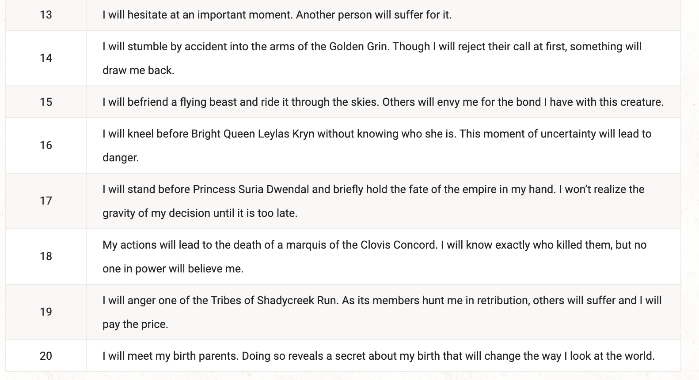

# Pretext
> The heroic chronicle is a system that allows players and Dungeon Masters to work together to build a compelling character story. It even allows characters to gain additional proficiencies, magic items, spells, or feats before the campaign begins. This section assumes that the player is starting from scratch—without having chosen a race, class, or background for their character. The events that occur as a result of these random rolls inform what kind of character the player has. A player who already has a character concept in mind can choose options from the tables instead of rolling randomly, ignoring anything that doesn’t fit their character concept. If you’re a player using these tables, don’t be surprised if creating a backstory inspires you to change some aspect of your character concept. Let this tool inspire your imagination rather than limit it.

# Backgrounds 

From your background you will either gain an ally or rival. I will send this to each of you in a private message.

# Home

Already done this with you guys so don't worry about it.

# Immediate Family
For those of you that have some that may appear at somepoint

(there are actually other options here but this makes the most sense for all of you)

- 1d4 for siblings

## Traits
Now choose a gender and age for each of them

## Relationships
To quote the text
> Even before your adventuring career began, you had allies who supported you and rivals who sought to thwart your success. In some cases, your allies might be so devoted that they are indispensable companions, while your rivals are hateful enough to make them nothing short of mortal enemies.

> Your first allies and rivals are your family. Sometimes your family members are your closest friends. Sometimes you hate their guts. Roll a d3. This is the number of powerful relationships you have within your family.

so there should be d3 of those that relationships that are good/bad.

roll on the following table to figure out which are good/ bad

## relationships
At this point you should have gained some allies/ rivals from your backgroudnd and family.

now roll (or choose) on the 2 tables to determine _why_ they are an ally or rival 

Now roll some identities for these allies and rivals.

## Fateful Moments
Fateful moments are things in your past that have led to you choosing this adventuring life.

Now assuming you rolled a fateful moment ( or perhaps multiple?) you can roll on the fateful moment table (or choose) for each of these.

then there's a bunch of info in the book about favourite foods and stuff. Feel free to invent your own :)

## Mysterious Secrets
choose a mysterious secret if you want!

## Prophecies
This is where things get interesting.

So this is an opportunity for you as a player to dictate the sort of hard points your characters story will follow. For example will they have to "choose between doing what's right and saving someone they care about". Fortunately if you don't want to invent one you can have a look in the following table.

You should choose 3 prophecies that you wish to possibly expereience (I as the dm will do my best to accomodate).

